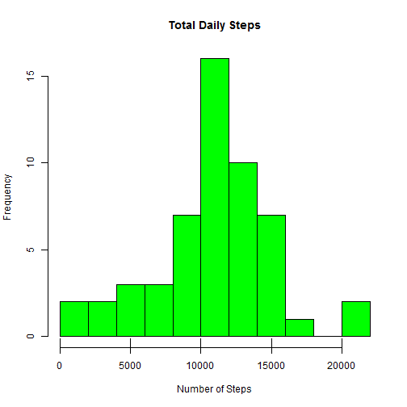
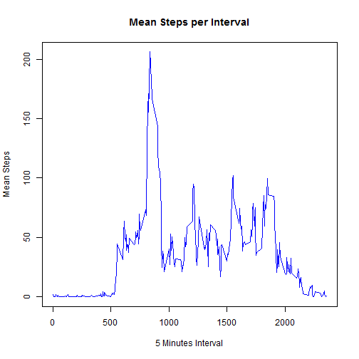
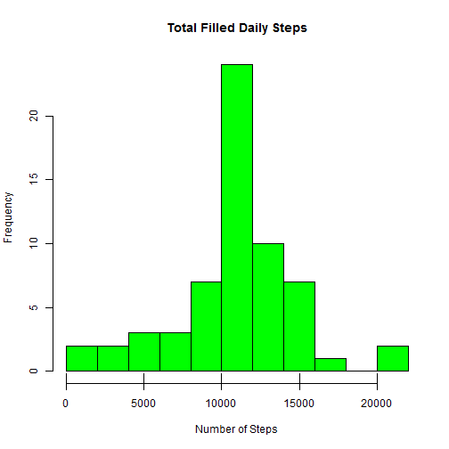
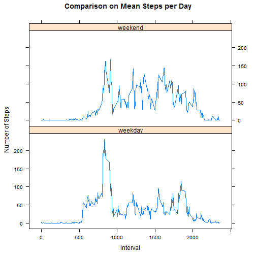

## Loading and preprocessing the data

We will use the **dplyr** package for loading and analyzing data.


```r
library(dplyr)
```

Now, load the data from the zip file:


```r
data <- tbl_df(read.csv(unzip("activity.zip",
                        files = "activity.csv")))
```

And take a peak at it:


```r
data
```

```
## Source: local data frame [17,568 x 3]
## 
##    steps       date interval
##    (int)     (fctr)    (int)
## 1     NA 2012-10-01        0
## 2     NA 2012-10-01        5
## 3     NA 2012-10-01       10
## 4     NA 2012-10-01       15
## 5     NA 2012-10-01       20
## 6     NA 2012-10-01       25
## 7     NA 2012-10-01       30
## 8     NA 2012-10-01       35
## 9     NA 2012-10-01       40
## 10    NA 2012-10-01       45
## ..   ...        ...      ...
```

## What is mean total number of steps taken per day?

Group the data per day:


```r
by_day <- group_by(data, date)
```

Get the total number of daily steps:


```r
daily_steps <- summarise(by_day, sum_steps = sum(steps))
```

And plotting a histogram of them:


```r
with(daily_steps,
     hist(sum_steps,
          main = "Total Daily Steps",
          xlab = "Number of Steps",
          col = "green",
          breaks = 15))
rug(daily_steps$steps)
```

 

And obtaining the mean and median of them:


```r
mean_daily_steps <- mean(daily_steps$sum_steps, na.rm = TRUE)
median_daily_steps <- median(daily_steps$sum_steps, na.rm = TRUE)
```

And their values are:

* Mean: 1.0766189 &times; 10<sup>4</sup>
* Median: 10765

**Note**: Removing missing values is important because we need to calculate the values for the data we actually have. If we were to remove missing values by the point we summed the daily steps, we would end up with zero daily steps and these values would have been different!

## What is the average daily activity pattern?

For this step, we'll group the data by interval, averaging over all of the days:


```r
by_interval <- group_by(data, interval)
mean_interval_steps <- summarise(by_interval,
                                 mean_steps = mean(steps, na.rm = TRUE))
```

And then plot:


```r
with(mean_interval_steps,
     plot(interval,
          mean_steps,
          main = "Mean Steps per Interval",
          xlab = "5 Minutes Interval",
          ylab = "Mean Steps",
          type = "l",
          col = "blue"))
```

 

Retrieve the interval with maximum number of steps on average accross days:


```r
max_interval_index = which.max(mean_interval_steps$mean_steps)
max_interval = mean_interval_steps$interval[max_interval_index]
max_interval
```

```
## [1] 835
```

## Imputing missing values

We had a brief discussion about this earlier. Now, we'll go a little bit deeper.
First, we check how many missing values (NAs, in this case) we have:


```r
na_count = sum(is.na(data))
na_count
```

```
## [1] 2304
```

Now, we will fill the missing intervals with their average accross all days:


```r
filled_data <- data
for (i in 1:nrow(filled_data)) {
    if (is.na(filled_data$steps[i])) {
        mis <- mean_interval_steps
        interval <- filled_data$interval[i]
        filled_data$steps[i] = mis$mean_steps[mis$interval == interval]
    }
}
```

And we repeat the analysis of mean and median made before, but with our "filled" data:


```r
by_filled_day <- group_by(filled_data, date)
filled_daily_steps <- summarise(by_filled_day, sum_steps = sum(steps))
with(filled_daily_steps,
     hist(sum_steps,
          main = "Total Filled Daily Steps",
          xlab = "Number of Steps",
          col = "green",
          breaks = 15))
rug(filled_daily_steps$steps)
```

 

And obtaining the mean and median of them:


```r
mean_filled_daily_steps <- mean(filled_daily_steps$sum_steps)
median_filled_daily_steps <- median(filled_daily_steps$sum_steps)
```

And their values are:

* Mean: 1.0766189 &times; 10<sup>4</sup>
* Median: 1.0766189 &times; 10<sup>4</sup>

We can observe that the missing data is not affecting our results as only a very small amount of data is absent.

## Are there differences in activity patterns between weekdays and weekends?

To aid us in this one, we'll use **lubridate** to make life easier. We'll start by tagging days as either "weekday" or "weekend":


```r
library(lubridate)
day_map <- c()
day_map[2:6] <- "weekday"
day_map[c(1, 7)] <- "weekend"
day <- ymd(filled_data$date)
day <- factor(day_map[wday(day)], c("weekday", "weekend"))
filled_data <- mutate(filled_data, day = day)
head(filled_data)
```

```
## Source: local data frame [6 x 4]
## 
##       steps       date interval     day
##       (dbl)     (fctr)    (int)  (fctr)
## 1 1.7169811 2012-10-01        0 weekday
## 2 0.3396226 2012-10-01        5 weekday
## 3 0.1320755 2012-10-01       10 weekday
## 4 0.1509434 2012-10-01       15 weekday
## 5 0.0754717 2012-10-01       20 weekday
## 6 2.0943396 2012-10-01       25 weekday
```

And **lattice** for our panels:


```r
library(lattice)
by_day_interval <- group_by(filled_data, day, interval)
averaged_over_days <- summarise(by_day_interval, mean_steps = mean(steps))
with(averaged_over_days, xyplot(mean_steps ~ interval | day,
                                type = "l",
                                main = "Comparison on Mean Steps per Day",
                                xlab = "Interval",
                                ylab = "Number of Steps",
                                layout = c(1, 2)))
```

 

Thank you for reading!
